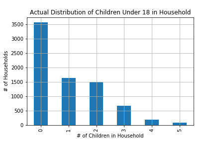
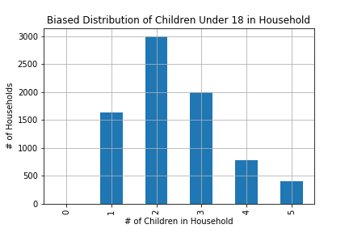

[Think Stats Chapter 3 Exercise 1](http://greenteapress.com/thinkstats2/html/thinkstats2004.html#toc31) (actual vs. biased)

> Use the respondent variable `NUMKDHH` to construct an actual distribution of the number of children under 18 in the household and the biased distribution (including themselves). Then plot the results and compute their means.


I started by loading the data and extracting the relevent data...

```python

resp = nsfg.ReadFemResp()
numkdhh = resp.numkdhh
```

From there we can find the actual mean value...

```python
numkdhh.describe()
"""
count    7643.000000
mean        1.024205
std         1.188717
min         0.000000
25%         0.000000
50%         1.000000
75%         2.000000
max         5.000000
Name: numkdhh, dtype: float64
"""
```

and then group by value

```python
real_counts = numkdhh.value_counts()
```
| # of Children <br/> Under 18 | Number of <br/> Families |
|--|--|
|0 |3563 |
|1 |1636| 
|2 | 1500|
|3 | 666|
|4 | 196|
|5|  82|

and we can plot the actual distribution as follows...

```python

real_counts.plot.bar()
plt.title('Actual Distribution of Children Under 18 in Household')
plt.xlabel('# of Children in Household')
plt.ylabel('# of Households')
plt.grid()
plt.savefig('./_ex03_01_actualDistribution.png')

```



then, to create the biased distribution we can do the following...

```python

biased_counts = real_counts.copy()
for i, c in enumerate(biased_counts):
    biased_counts[i] = c * i
    
# And plot the values...
biased_counts.plot.bar()
plt.title('Biased Distribution of Children Under 18 in Household')
plt.xlabel('# of Children in Household')
plt.ylabel('# of Households')
plt.grid()
plt.savefig('./_ex03_01_biasedDistribution.png')
    
```



then, we can also get the biased mean...

```python
biased_mean = sum(i * n for i, n in enumerate(biased_counts)) / biased_counts.sum()
```

The two means are as follows:

| Distribution | Mean |
| --- | --- |
| Actual | 1.024205 |
| Biased | 2.403679100664282 |


Clearly, using the biased data would skew the results considerably.


