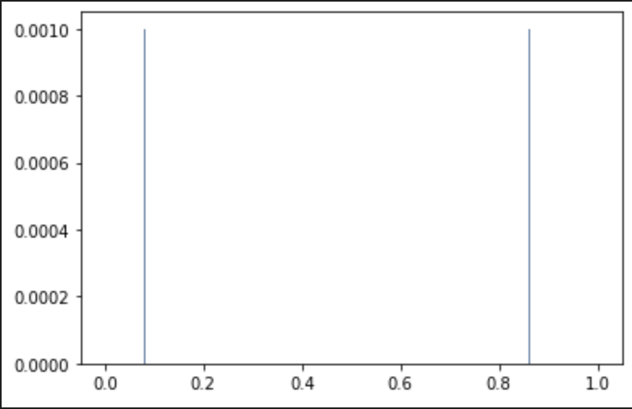

[Think Stats Chapter 4 Exercise 2](http://greenteapress.com/thinkstats2/html/thinkstats2005.html#toc41) (a random distribution)

> Generate 1000 random numbers with `np.random.random` then plot their PMF and CDF. Is the distribution uniform?

I started by generating 1000 random uniform numbers with numpy

```python
r = np.random.random(1000)
```

Then I plotted the PMF...

```python
rand_pmf = thinkstats2.Pmf(r)
thinkplot.Hist(rand_pmf, align='right')
```



but there seem to only be two slight non-zero spikes and the rest is nearly at zero. The problem is that with 16-digits of precision, there are 10^16 possible values and so, as the book says, the effect of random noise increases.

Next I plotted the CDF...

```python
rand_cdf = thinkstats2.Cdf(r)
thinkplot.Cdf(rand_cdf)
```


this shows that the distribution seems to be pretty uniform, as we'd expect.
